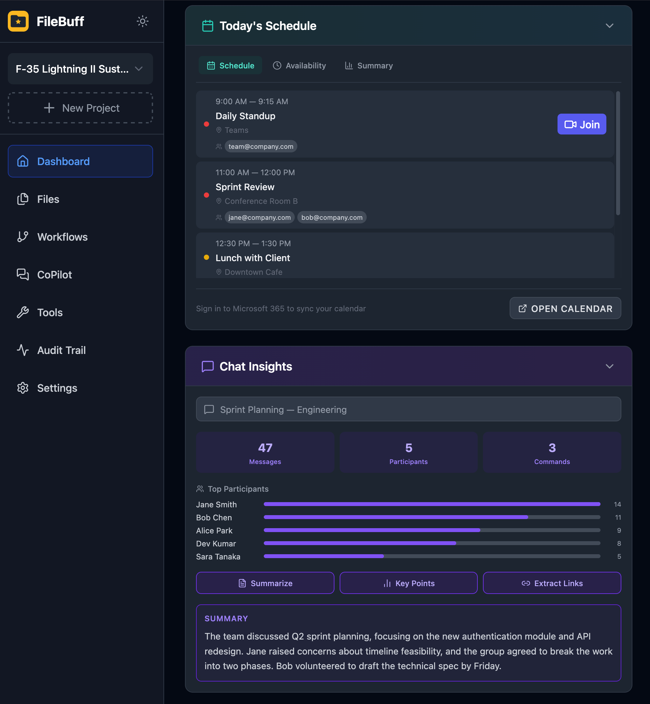
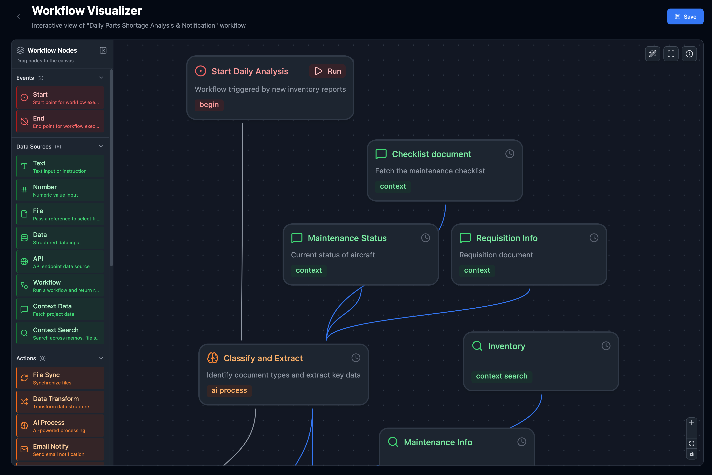
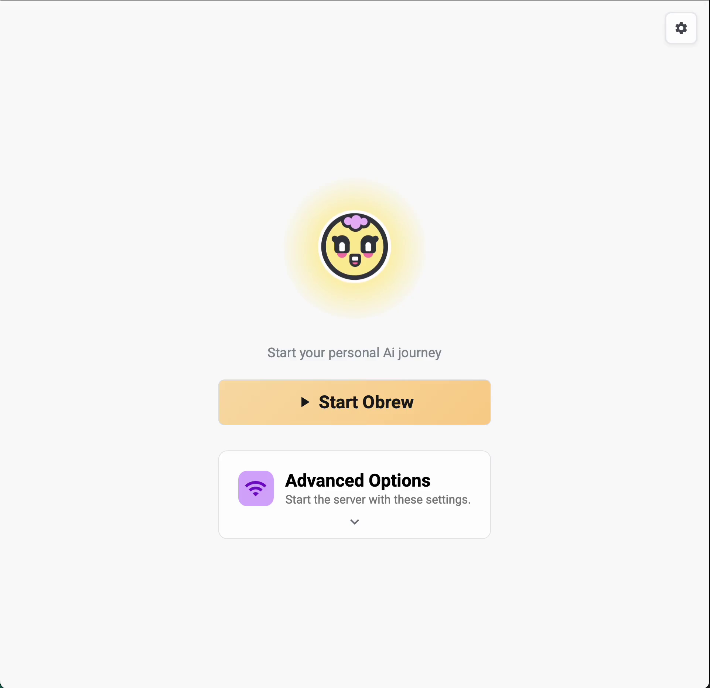
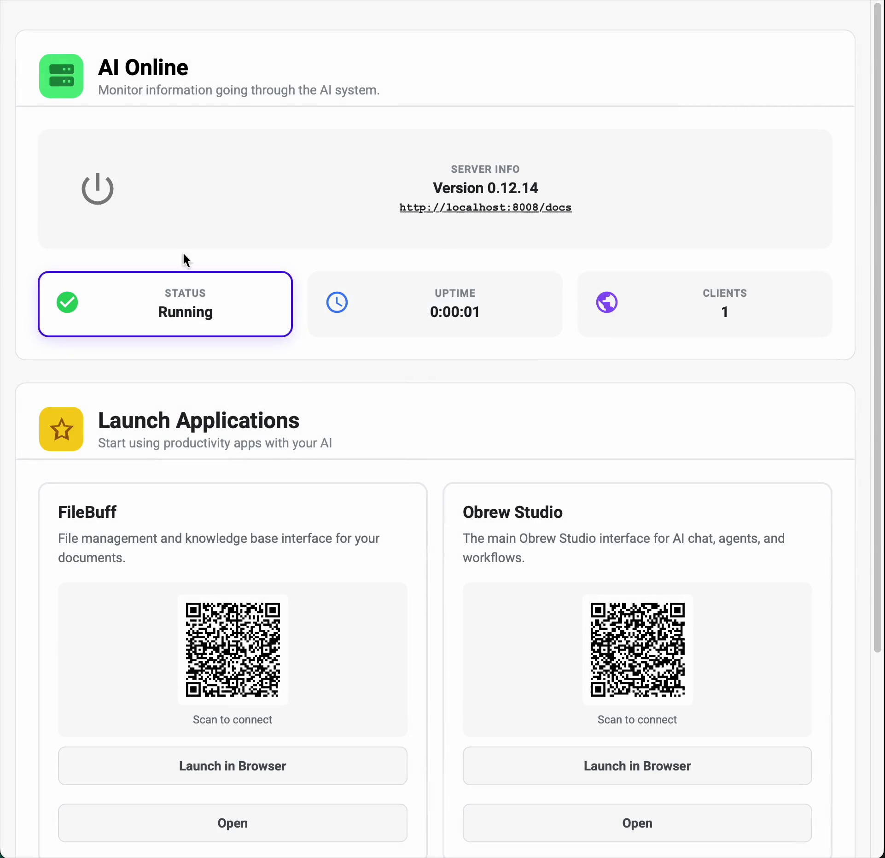

# Capability Statement

## Company Details

**Name:** OpenBrew.ai

**Website:** https://www.openbrew.ai

**Founder & Principal Engineer:** Sorob Raissi

**Contact:** sorob@openbrew.ai

## TSM Awardable Status

## Solutions

### 1. FileBuff - Project Intelligence on Demand

An AI-powered project platform that automates workflow/email/meeting creation, streamlines file management, and acts as a virtual manager for government and enterprise teams. Any team member can search and access project data in natural language. Assign tasks and workflows to your personal AI from any device and let it run in the background.

  
  

#### **Core Capabilities**

AI-Powered Projects

- Search your project information in natural language (no more file hunting)
- Format documents to a specification
- View file version history to find changes
- Execute AI tasks from your chat app (Teams, Slack, Discord)

Workflow Automation

- Visual drag-and-drop workflow builder with actions for data processing, compliance, email, custom actions, and more
- Instruct AI to build custom workflows for you based on a description

Conversational CoWorker

- Ask questions, perform research, respond to email or complete real world tasks, all inside a chat conversation
- Agents get access to the same work tools you use everyday

Microsoft 365 Integration

- Deep integration with Outlook, Teams, Calendar, SharePoint, OneDrive, Contacts and more from the Office Suite
- Perform email drafting, meeting scheduling, access project info from Teams chat, and automatic SharePoint file sync

#### **Focus Areas**

- Deployable, autonomous virtual assistants
- Talk to your projects like a coworker
- Workflow Automation
- AI-driven analysis of many data sources
- Eliminate manual knowledge work

### 2. Obrew - AI Engine

An open-source, 100% private, AI platform that powers FileBuff and other third-party applications built on top of it. Obrew is a full-stack integration of inference engine, agent orchestrator, and data platform. It is packaged as a single desktop executable with no external services or internet required.

  
  

#### **Core Capabilities**

Local LLM

- GPU acceleration (CUDA, Metal) with support for desktop and laptop CPU
- Supports a variety of LLM's running privately on your device
- Built-in AI tools for data retrieval, parsing, generation, and more
- Agents can read documents, images, video, audio and structured/unstructured data.

Advanced Search

- Use natural language to search for data (fuzzy search)
- Agents can work together to find and understand information from various sources (email, messages, contacts, files, web)

Third Party App Support

- Self-documenting endpoints allows easy integration with IT environment
- Headless operation is supported for remote access
- Supports third-party app development without requiring vendor effort
- No LLM vendor lock-in. Use any cloud provider or open weights model in GGUF format

All-in-One Installation

- Easy to install with dependencies bundled
- No setup required

#### **Focus Areas**

- Edge AI Infrastructure: Provide a complete AI stack that eliminates cloud dependency, enabling AI in air-gapped, secure, or remote environments

- Provide simple, composable AI functionalities for developers and organizations to build custom AI-powered solutions with

- Unified pipeline for parsing, embedding, and semantically searching across diverse document types and enterprise data sources

- Intelligence, reasoning, tool use, browser use,

## Differentiators

- **Not Another Tool:**

  Built to perform work for you and with you. No complicated UI to learn, just natural language.

- **100% Private Data:**

  Requires no FedRAMP authorization, no subscription costs, and no cloud infrastructure. All AI runs on the user’s own device or IT hardware.

- **Any Operational Environment:**

  Operates without internet connectivity, in air-gapped or secure environments; deployable at all classification levels since data never leaves your device

- **Model Agnostic:**

  Any open-source model can be deployed; no vendor lock-in or procurement cycle required

- **Full-Stack, Batteries Included, Open-Source:**

  Built on auditable, open-source software with REST API interfaces enabling easy third-party integration

- **Microsoft 365 Native:**

  Leverages your existing software ecosystem; federated access to org data using existing single sign-on methods and security layers

- **Built-in Security:**

  Admin settings are provided to allow you control over what data sources your AI can access (camera, email, etc.)

## Experience

### Past Performance

- Built virtual worlds for simulation training used by Warfighters and First Responders

- Written command and control software for drones and pilots

- Experience building AI information systems

- Recently completed an SBIR Phase I with the CDAO and Air Force in 2026, delivering a fully functional prototype

### Relevant Gov Experience

- 10+ years of experience on classified Defense projects as a private contractor

- Past customers: Army, Navy, Air Force, Homeland Security

- Previous work: Simulation training, autonomous drones, (3d) spatial & data visualization

## Codes

### NAICS: 541715

Research and Development in the Physical, Engineering, and Life Sciences

### CAGE Code: 02V60

### UEI: Z2DEJ3B5VJH8

## Contracting Pathways

The following solutions are available for immediate rapid procurement:

#### FileBuff: Project Intelligence on Demand

[Procurement Link - (government login required)](https://cdao.appiancloud.us/suite/sites/tsm-marketplace-portal/page/tsm-marketplace-portal/record/sh_kFyShGApdRTjs4FmZq7SVQFB9YldK7M1z1qEIwPevDDtc_qoHVla11Du4FEi7n8nFWA5_maqYdHAJSfFKIenDKXOAtbBhGaPui10VZEPt6hbyxndsLLYE0_622XulogNqqpcL6M/view/summary)

#### Obrew: AI Engine

[Procurement Link - (government login required)](https://cdao.appiancloud.us/suite/sites/tsm-marketplace-portal/page/tsm-marketplace-portal/record/sh_kFyShGApdRTjs4FmZq7SVQFB9YldK7M1z1qEIwPevDDtc_qoHVla11Du4FEi7n8nFWA5_maqYdHAJSfFKIenDKXOAtbBhGaPui10VZANuqhbmz-R7fOjbJ5FHsovD7-w03PHjzU/view/summary)

### TSM Post-Competition

Assessed as **Awardable** through the CDAO Tradewinds Solutions Marketplace competitive assessment process; ready for rapid acquisition. Government customers can view all our video solutions and initiate procurement at [tradewindAI.com](https://www.tradewindai.com/tw-marketplace) (government login required). The Tradewinds Solutions Marketplace is the premier offering of
Tradewinds, the Department of Defense’s (DoD’s) suite of tools and services designed
to accelerate the procurement and adoption of AI/ML, data, and analytics capabilities.

### FAR-Based Contracts

Available for acquisition through standard Federal Acquisition Regulation based contract vehicles including firm-fixed-price (FFP) and cost-plus contracts. Registered and active on SAM.gov.

### SBIR/STTR

SBIR Phase I completed (Contract W519TC-25-P-0066, CDAO/Air Force). Phase II eligible upon program reactivation.

### Other Transaction Authority (OTA)

Available for prototype and production OT agreements under 10 U.S.C. § 4022. On-device architecture and open-source foundations support rapid prototyping and pilot deployments with minimal authorization overhead.

## Scan for link to this PDF

